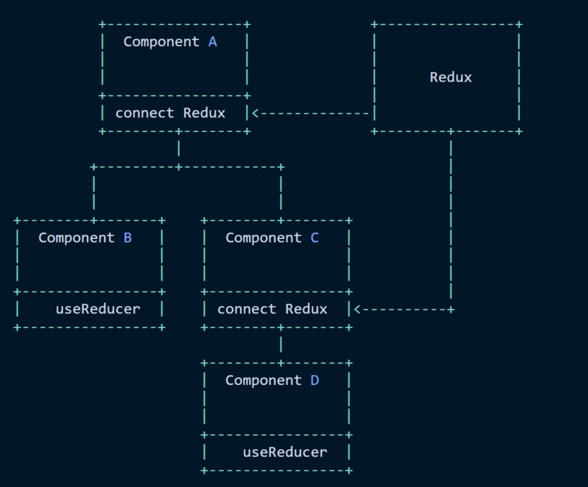

# Redux
> [Using useContext in combination with useReducer](https://www.robinwieruch.de/react-state-usereducer-usestate-usecontext/)

- Where your state is managed
    - Redux creates **one global state container** -- which hangs somewhere *above* your whole application.
    - useReducer creates a **independent component co-located state container** within your component.

- Rules
    -   Use `useState` for basic and simple/small size applications.
    -   Use `useState + useReducer + useContext` for advanced/medium size applications.
    -   Use `useState/useReducer + Redux` for complex/large size applications.  
        - If your state management needs Redux as *one global state container with middleware*, introduce Redux to your application to handle state logic in complex and large applications.

  